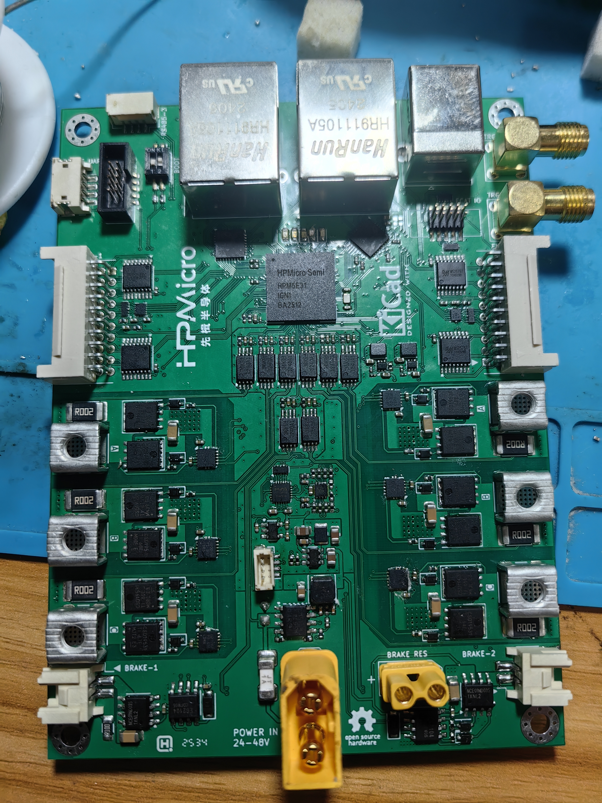
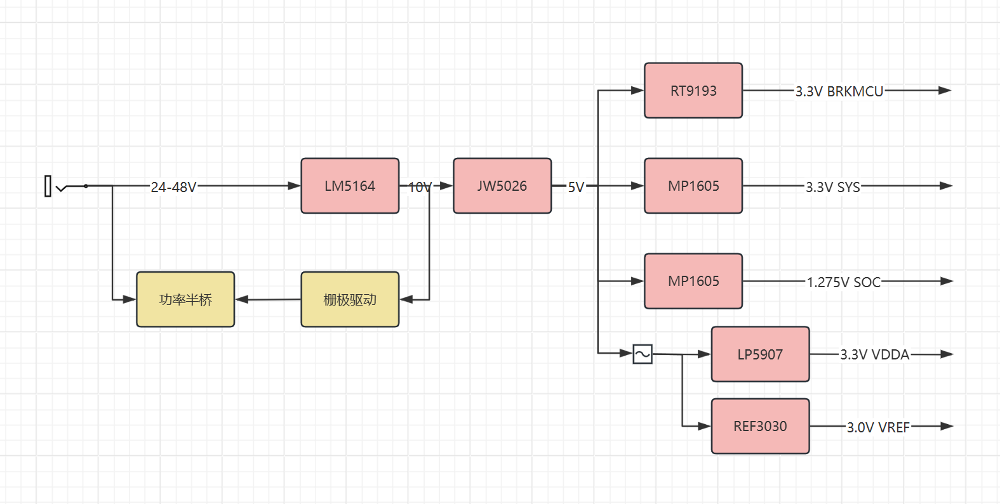
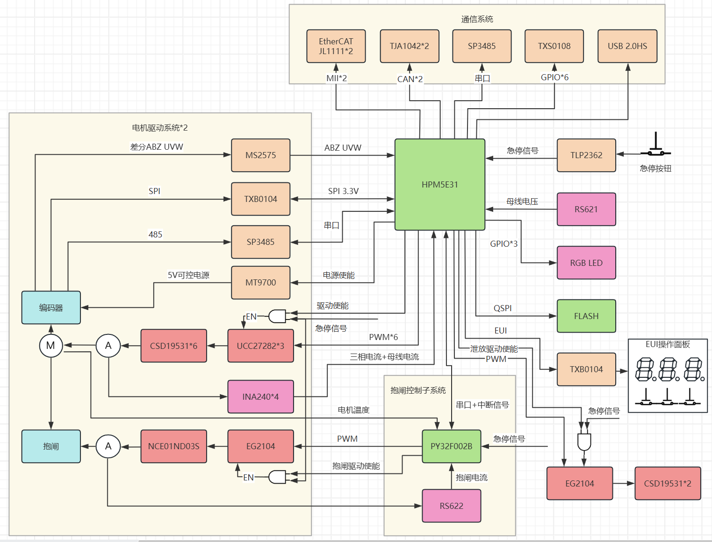

# 基于HPM5E31的双路EtherCAT高性能高精度FOC驱动板

仓库使用lfs，不能直接下载zip，jlink版本需要v10以上

## 产品规格：

| 支持电机数   | 2路                                                          |
| ------------ | ------------------------------------------------------------ |
| 动力电源     | 24VDC~60VDC                                                  |
| 额定输出电流 | 20Arms                                                       |
| 峰值输出电流 | 未测试                                                       |
| 急停按钮     | 光耦输入，支持常开式或常闭式接线或外部电源控制 支持硬件安全扭矩关断（SOT） |
| 反馈信号     | 差分ABZ 差分UVW 基于SPI接口的编码器（抗干扰弱） 基于高速485接口的编码器如多摩川 电机温度NTC |
| 能耗制动     | 可外接制动电阻                                               |
| 抱闸         | 支持，最大电流1A，支持电流测量                               |
| 冷却方式     | 可选的板载散热器和风扇主动散热                               |
| 脉冲方向控制 | 复用ABZ编码器接口可实现PD、UD模式脉冲输入                    |
| 模拟量输入   | 不支持                                                       |
| UART         | 支持一路调试串口                                             |
| RS485        | 硬件支持1路专用，2路与485编码器复用                          |
| CANFD        | 硬件支持2路                                                  |
| EtherCAT     | 硬件支持2端口                                                |
| USB2.0HS     | 支持一路Device TypeB接口                                     |
| 同步信号     | 支持2路TRGM IO，可输入输出PWM同步信号或PPS同步信号等         |
| 存储         | 程序flash 1Mbyte，外置数据qspiflash 128Mbit                  |

## 电源树：

## 硬件架构框图：

